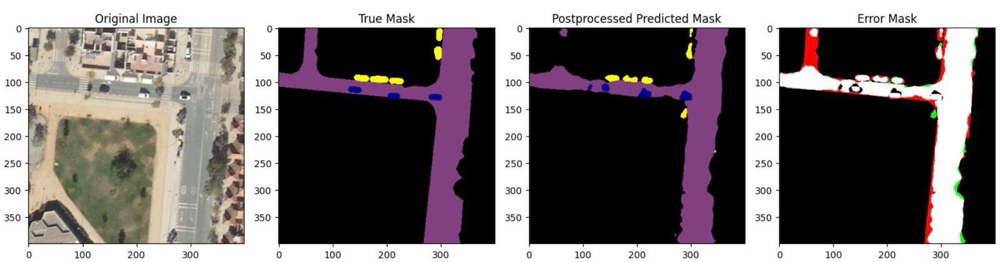

# Parking Space Detection in the city of Granada

The Parking Space Detection Project is a comprehensive exploration into applying deep learning models for the semantic segmentation of parking spaces in urban environments. Developed with a focus on Granada, Spain, this initiative leverages cutting-edge AI techniques to analyze aerial and street-level imagery for efficient parking space management, aiming to contribute valuable insights into urban planning and traffic control.



## Features

- **Models Used**: Incorporates advanced segmentation models including PSPNet, DeepLabV3+ and Dynamic U-Net.
- **Datasets**: Utilizes diverse datasets like UDD5, UAVid and a specially curated Granada dataset, GranadaAerial, to train and validate the models.
- **Custom Data Augmentation**: Employs different data augmentation strategies to enhance model performance under varied urban scenarios.
- **Transfer Learning**: Applies transfer learning to adapt pre-trained models to specific characteristics of urban Granada.
- **Model Evaluation**: Detailed performance analysis of each model, showcasing DeepLabV3+ as the most effective for this application.

### Training

The training module is used to train the models on the given dataset. The training module can be executed using the following command from the root directory of the project:

```bash
python -m src.models.train
```

## Documentation

The documentation for this project is available at the docs folder. The documentation is built using Sphinx and can be built locally using the following command:

```bash
cd docs
make html
```

For reading the documentation, execute a python server in the `docs/build/html` folder and open the `index.html` file in a browser.

```bash
cd docs/_build/html
python -m http.server 8001
```

And from the browser, open http://localhost:8001

## Authors

-  Luis Crespo Orti
-  Isabel María Moreno Cuadrado
-  Pablo Olivares Martínez
-  Ximo Sanz Tornero

## Citation

If you use this project in your research, please cite it using the following BibTeX entry:

```bibtex
@misc{CMOS2023parkingspacedetection,
  author  = "Crespo Orti, Luis and Moreno Cuadrado, Isabel María and Olivares Martínez, Pablo and Sanz Tornero, Ximo",
  title   = "Parking Space Detection in the City of Granada",
  note    = "Available at GitHub: \url{https://github.com/pab1s/granada-parking-segmentation}",
  month   = "jan",
  year    = "2023",
}
```
